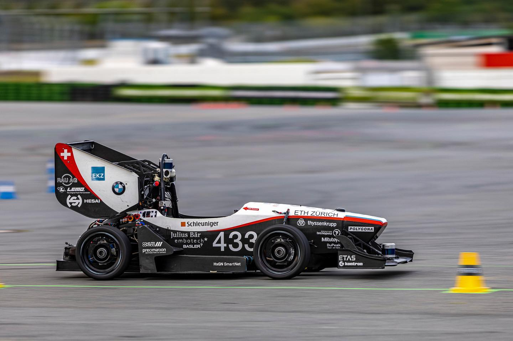
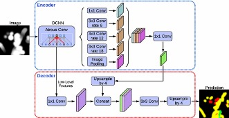
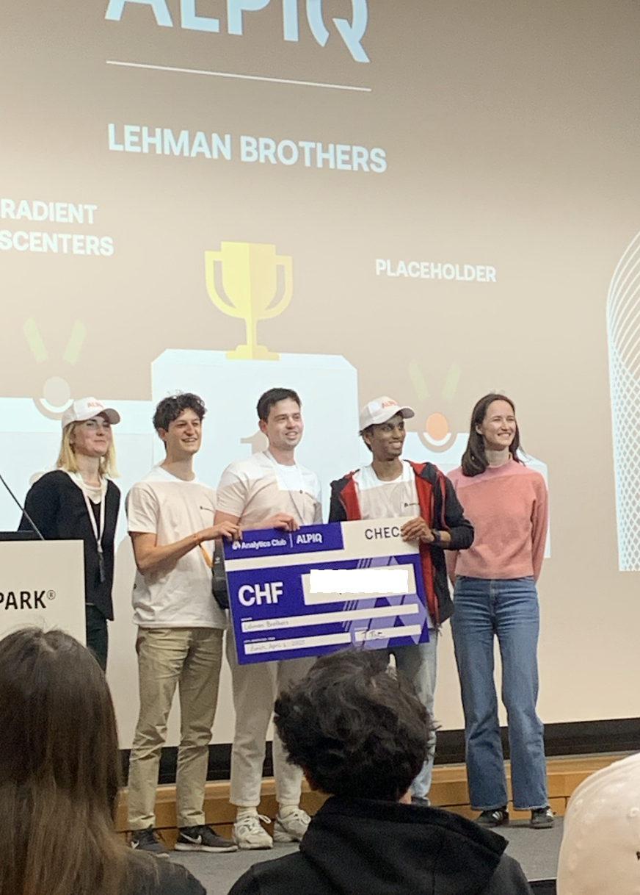

# Lalatendu Bal 

&nbsp;&nbsp;&nbsp;&nbsp;&nbsp;&nbsp; &nbsp; 

<table>
  <tr>
    <td valign="top" width="50%">
      <h3>Background</h3>
      Robotics Engineer with experience in both industry and academia, specializing in applied machine learning and computer vision for autonomous system.
    </td>
    <td valign="top" width="50%">
      <h3>Focus</h3>
      Interested in developing and deploying real-time machine learning and vision solutions for autonomous robotics platforms.
    </td>
  </tr>
  <tr>
    <td valign="top" width="50%">
      <h3>Affiliations</h3>
      <ul>
        <li>RWTH Aachen</li>
        <li>ETH Zürich</li>
        <li>Bosch GmbH</li>
        <li>Automotive Research Association of India</li>
      </ul>
    </td>
    <td valign="top" width="50%">
      <h3>Interests</h3>
      <ul>
        <li>Hiking</li>
        <li>Camping</li>
        <li>Formula 1</li>
        <li>Guitar</li>
      </ul>
    </td>
  </tr>
</table>

<!-- 
<table border="0" cellpadding="8" cellspacing="0">
  <tr>
    <td valign="top" width="20%">
    <h3 align="center">Programming</h3>
    <table border="0">
      <td align="center" width="96">
        <a href="https://www.python.org" target="_blank" rel="noreferrer">
           Python
        </a>
      </td>
      <td align="center" width="96">
        <a href="https://www.w3schools.com/cpp/" target="_blank" rel="noreferrer">
           C++
        </a>
      </td>
      <tr>
        <td align="center" width="96">
          <a href="https://www.gnu.org/software/bash/" target="_blank" rel="noreferrer">
             Bash
          </a>
        </td>
        <td align="center" width="96">
          <a href="https://www.mathworks.com/" target="_blank" rel="noreferrer">
             MATLAB
          </a>
        </td>
        <tr>
        <td align="center" width="96">
          <a href="https://julialang.org/" target="_blank" rel="noreferrer"> Julia
          </a>
        </td>
        </td>
        <td></td>
      </tr>
    </table>
  </td>

  <td valign="top" width="40%">
  <h3 align="center">Robotics, AI & Simulation</h3>
  <table border="0">
    <tr>
      <td align="center" width="96">
        <a href="https://www.ros.org/" target="_blank" rel="noreferrer">
           ROS
        </a>
      </td>
      <td align="center" width="96">
        <a href="https://developer.nvidia.com/isaac/sim" target="_blank" rel="noreferrer">
           Isaac Sim
        </a>
      </td>
      <td align="center" width="96">
        <a href="https://pytorch.org/" target="_blank" rel="noreferrer">
           PyTorch
        </a>
      </td>
    </tr>
    <tr>
      <td align="center" width="96">
        <a href="https://www.tensorflow.org" target="_blank" rel="noreferrer">
           TensorFlow
        </a>
      </td>
      <td align="center" width="96">
        <a href="https://opencv.org/" target="_blank" rel="noreferrer">
           OpenCV
        </a>
      </td>
      <td align="center" width="96">
        <a href="https://numpy.org/" target="_blank" rel="noreferrer">
           NumPy
        </a>
      </td>
    </tr>
    <tr>
      <td align="center" width="96">
        <a href="https://pandas.pydata.org/" target="_blank" rel="noreferrer">  Pandas 
        </a> 
      </td>
      <td align="center" width="96">
        <a href="https://scikit-learn.org/" target="_blank" rel="noreferrer">  Scikitlearn 
        </a>
      </td>
      <td align="center" width="96">
        <a href="https://developer.mozilla.org/en-US/docs/Web/matplotlib" target="_blank" rel="noreferrer">  Matplotlib 
        </a>
      </td>
    </tr>
  </table>
  </td>

  <td valign="top" width="40%">
  <h3 align="center">Tools, Systems & Deployment</h3>
  <table border="0">
    <tr>
      <td align="center" width="96">
        <a href="https://git-scm.com/" target="_blank" rel="noreferrer">
           Git
        </a>
      </td>
      <td align="center" width="96">
        <a href="https://www.linux.org/" target="_blank" rel="noreferrer">
           Linux
        </a>
      </td>
      <td align="center" width="96">
        <a href="https://www.docker.com/" target="_blank" rel="noreferrer">
           Docker
        </a>
      </td>
    </tr>
    <tr>
      <td align="center" width="96">
        <a href="https://www.jenkins.io" target="_blank" rel="noreferrer">
           Jenkins
        </a>
      </td>
      <td align="center" width="96">
        <a href="https://jupyter.org/" target="_blank" rel="noreferrer">
           Jupyter
        </a>
      </td>
      <td align="center" width="96">
        <a href="https://www.anaconda.com/" target="_blank" rel="noreferrer">
           Anaconda
        </a>
      </td>
    </tr>
    <tr>
      <td align="center" width="96">
        <a href="https://flutter.dev" target="_blank" rel="noreferrer">  Flutter 
        </a> 
      </td>
      <td></td>
      <td></td>
    </tr>
  </table>
</table>
 -->

<h3 align="left">Programming</h3>

 
 

<h3 align="left">Robotics, AI & Simulation</h3>
 
 
 

 
 
 

<h3 align="left">Tools, Systems & Deployment</h3>
 
 
 
 
 

 

<h1 align="left">Project Highlights</h1>

<table>
  <tr>
    <td align="center" width="33%">
        
      <b>AMZ Racing Driverless</b> 
        Formula Student team at ETH Zürich developing a driverless race car for international competitions.
    </td>
    <td align="center" width="33%">
        
      <b>Scene Segmentation</b> 
      Short one-line description of the project and what it does.
    </td>
  </tr>
  <tr>
    <td align="center" width="33%">
        
      <b>Charlet Carsharing</b> 
      A simple solution for sharing car rides and making daily commutes more engaging in Switzerland.
    </td>
    <td align="center" width="33%">
        
      <b>Datathon 2025 Winner </b> 
      Switzerland's largest hackathon dedicated to machine learning. Check out the <a href="https://www.youtube.com/watch?v=OtboiH0cJPs&t=2s">2025 aftermovie</a>.
    </td>
  </tr>
</table>

 
 

---

